# cmpe-283-1
## Assignment 1
#### Group -
#### Parvathi Pai - 015293460
#### Shreya Ghotankar - 015304393

#### For each member in your team, provide 1 paragraph detailing what parts of the lab that member implemented / researched?

#### Parvathi Pai:
* Cloned the Kernel code from GitHub repository.
* Identified the information from SDM.
* Updated the code in cmpe283-1.c for the MSRs 0x482, 0x48B, 0x483, 0x484
* Generated the desired output and took snapshots of it.
* Created the initial documentation.
#### Shreya Ghotankar:
* Cloned the Kernel code from GitHub repository.
* Compiled the Kernel code
* Re-built and tested the modified cmpe283-1.c code.
* Added snapshots of output after testing.
* Updated the documentation.

## Steps followed –

1. Install VMware Fusion (Mac OS) /Workstation (Windows) and Ubuntu
2. Create a VM machine that will run on Ubuntu.
3. Install git: sudo apt-get install git
4. Install make: sudo apt-get install make
5. Install gcc: sudo apt-get install gcc
6. Clone the Kernel code from GitHub: git clone https://github.com/torvalds/linux.git

Kernel Code Compilation :
* sudo apt-get install build-essential kernel-package fakeroot libncurses5-dev libssl-dev ccache bison flex libelf-dev
* uname -a
* cp -v /boot/config-5.4.0-52-generic ./.config
* make oldconfig
* make -j
* sudo make modules
* sudo make modules_install
* sudo make install
* reboot
* uname -a
   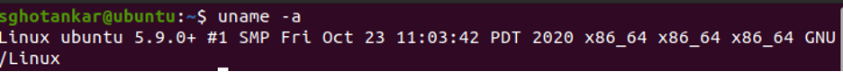
7. Downloaded the Makefile and cmpe283-1.c file from the SJSU canvas
 * Build the file using make
   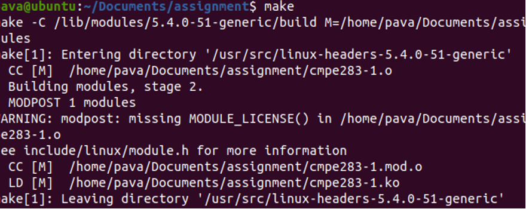
 * After building the file check if there is kernel object file is created.
    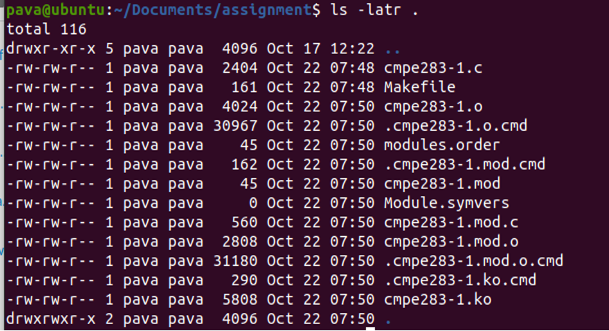
 * After sudo insmod ./cmpe283-1.ko and dmesg the configuration of kernel is –
Output of pinbased controls
    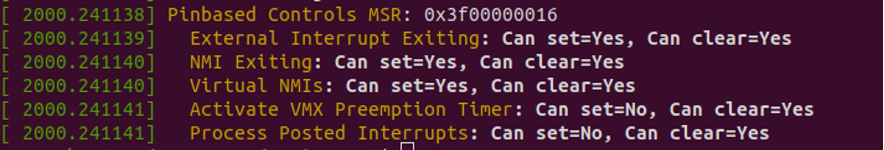
 *  Then in the cmpe283-1.c file added the configuration of the various controls and build the file.
 * To rebuild the file use commands – 
    * sudo rmmod cmpe283-1
    * sudo insmod ./cmpe283-1.ko
    * dmesg
  

  ## Output:
1. Output of Procbased control
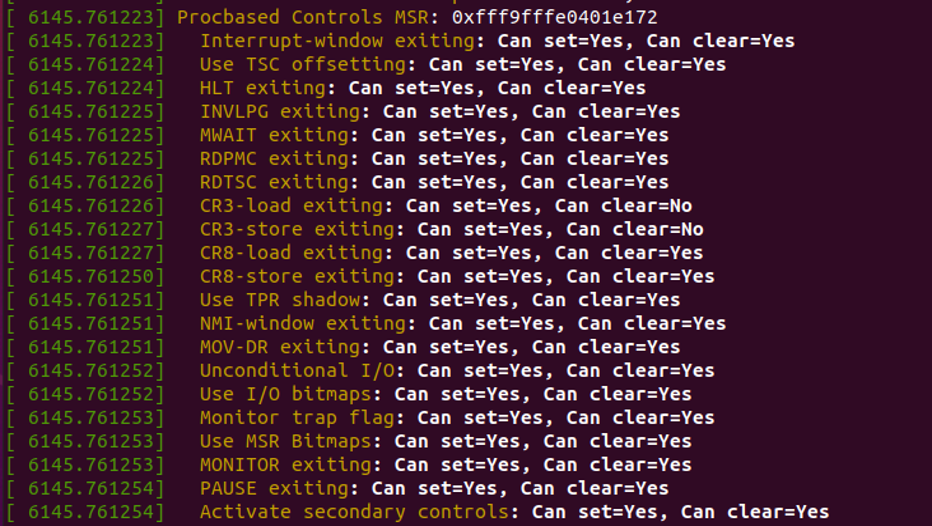
After testing: 
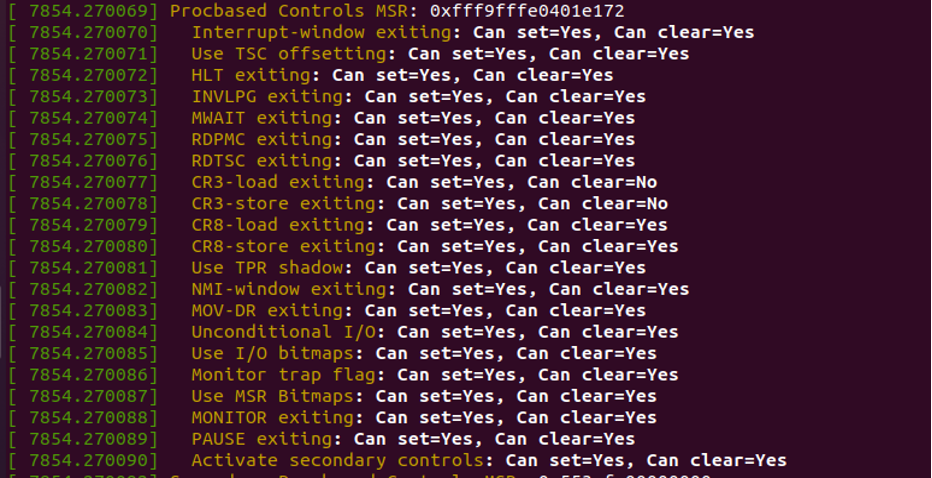

2. Secondary Procbased controls
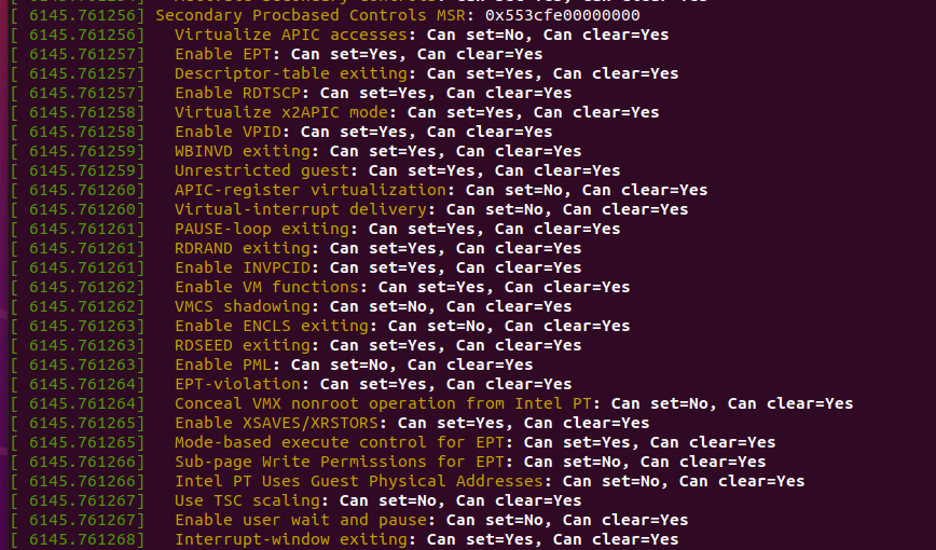
After testing: 
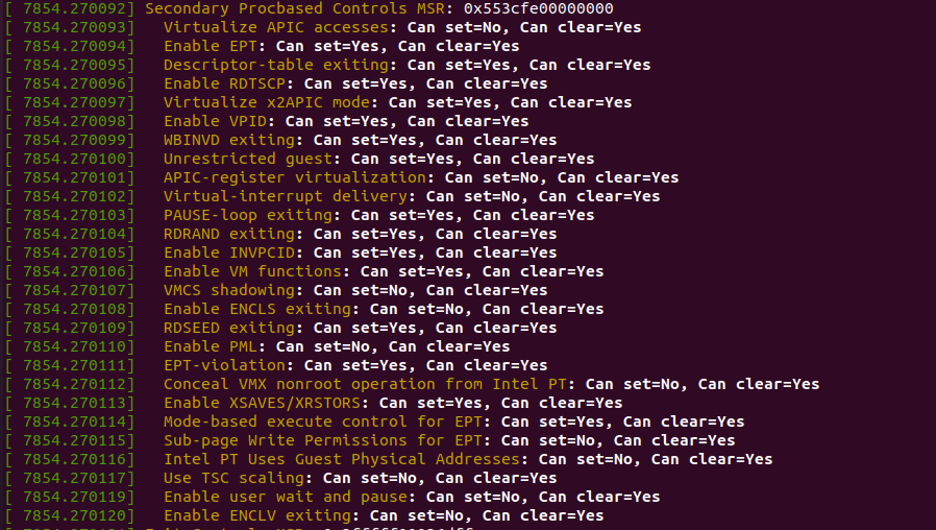

3. VM Exit controls
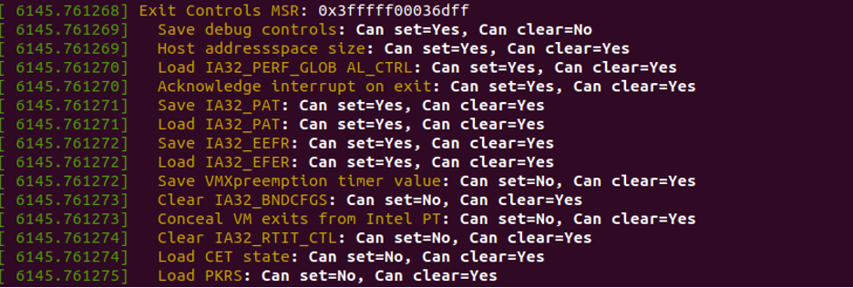
After testing: 
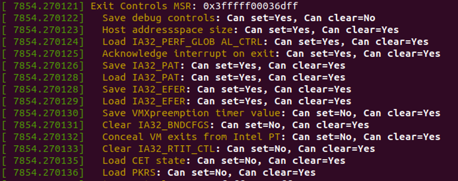

4. VM Entry controls
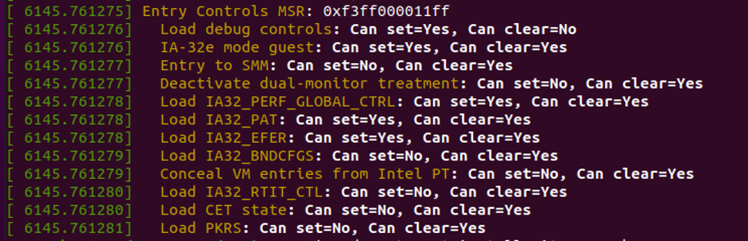
After testing:

